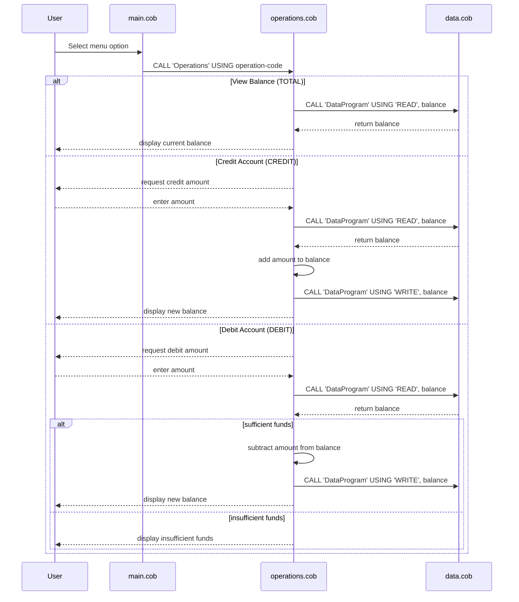

# COBOL Student Account System Documentation

This documentation describes the purpose of each COBOL source file in the repository, the key program flows, and the business rules for student account management.

## Overview

The COBOL project is a simple account management system that allows a user to view a balance, credit an account, debit an account, and exit the program. The implementation is split across three COBOL programs:

- `src/cobol/main.cob`
- `src/cobol/operations.cob`
- `src/cobol/data.cob`

Although the program does not explicitly define a student record structure, it is intended to model a student account workflow with balance inquiry, deposit, and withdrawal behavior.

## File Responsibilities

### `src/cobol/main.cob`

Purpose:
- Acts as the main program and user interface.
- Displays a menu offering options to view balance, credit account, debit account, or exit.
- Accepts the users menu choice and dispatches the selected action by calling `Operations`.

Key behavior:
- Uses an `EVALUATE` statement to branch on menu selections.
- Calls `Operations` with one of the operation codes: `TOTAL`, `CREDIT`, `DEBIT`, or exits on choice `4`.
- Keeps prompting the user until they choose to exit.

### `src/cobol/operations.cob`

Purpose:
- Receives the requested operation from `main.cob`.
- Coordinates loading account data, updating balances, and writing results.

Key behavior:
- Reads the current account balance and displays it for `TOTAL`.
- Prompts for an amount and performs a credit operation when `CREDIT` is selected.
- Prompts for an amount and performs a debit operation when `DEBIT` is selected.
- Calls `DataProgram` to read or write the account balance.

### `src/cobol/data.cob`

Purpose:
- Acts as the data access program for the account balance.
- Stores the account balance in working-storage and responds to read/write requests.

Key behavior:
- Supports two operations via the `LINKAGE SECTION`: `READ` and `WRITE`.
- On `READ`, copies the stored balance into the passed-in balance field.
- On `WRITE`, updates the stored balance with the passed-in value.

## Key Functions and Flow

1. `main.cob` displays the menu and accepts user input.
2. `main.cob` calls `Operations` with one of the operation codes.
3. `operations.cob` interprets the operation code:
   - `TOTAL`: display the current balance.
   - `CREDIT`: request a credit amount, add it to the balance, and save it.
   - `DEBIT`: request a debit amount, validate funds, subtract it if possible, and save it.
4. `operations.cob` calls `DataProgram` to read or write the balance.
5. `data.cob` stores the current balance in memory and handles the requested data action.

## Business Rules for Student Accounts

- The account begins with an initial balance of `1000.00`.
- A balance inquiry (`TOTAL`) simply displays the current stored balance.
- A credit operation (`CREDIT`) increases the balance by the entered amount.
- A debit operation (`DEBIT`) only succeeds if the account has sufficient funds.
- If a debit amount exceeds the available balance, the debit is rejected and the balance remains unchanged.
- The program does not currently support negative balances, student IDs, or transaction history.

## Notes

- The current implementation uses internal working-storage for the balance rather than a persistent database or file.
- The logic is structured to keep the user-facing menu separate from the operation logic and data access logic.
- This layout supports future modernization, such as replacing `DataProgram` with a database or file-backed persistence layer.

## Sequence Diagram

